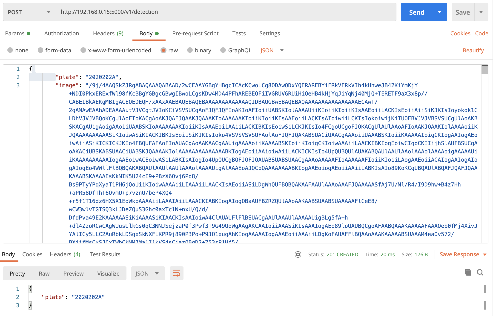

<h1 align="center"> Control of Access to Natural Spaces</h1>


[](https://github.com/ellerbrock/open-source-badges/)
[](https://www.python.org/)
[](https://github.com/claragubau/control-natural-spaces/actions/workflows/code-style-check.yml)

## Motivation
Aquest projecte está motivat per [Smart Catalonia]( https://participa.challenge.cat/assemblies/agentsrurals). L'objectiu és optimitzar i automatizar el control d'accés a espais naturals.


## Requisits
### Material
- PiCamera
- Raspberry Pi
## Detector
### Ús
Per a instalar el software, runneja el següent script en una Raspberry amb càmera i internet.

```bash
sudo source run.sh OPTION
```
On option és un paràmetre per a escollir la estratègia desitjada:
    - **openALPR**: utilitzar OpenALPR
    - **tensorflow**: utilitzar Tensorflow Lite + OpenALPR

### Com funciona?
#### Opció 1: OpenALPR
Aquesta seria la nostra primera opció ja que és la que requereix dispositius amb menys potència. OpenALPR és una llibreria open-source que detecta matrícules que compleix tots els nostres requísits:
- L'imatge havia de ser processada localment: enviar streamings de vídeo a un servidor i analitzar-los allà és una solució molt poc eficient, a més és una solució que introdueix a la equació la latència de la xarxa lo qual pot fer que tot vagi molt lent.
- Ha de funcionar amb imatges de baixa qualitat, la idea és fer servir una càmara d'una raspberry.
- Ha de ser de lliure ús: en aquest cas la llibreria disposa d'una llicència open source AGPL.

L'script que realitzaria aquesta opció el podem trobar a [src/openALPR.py](src/openALPR.py).

#### Opció 2: Tensorflow Lite + OpenALPR
En el cas de que el nombre de falsos positius fos molt alt, optaríem per a fer servir també una xarxa neuronal convolucional per a detectar primer als cotxes. En aquest cas hem obtat per un detector molt eficient pensat per a ser executat en dispositius mobils, SSD Mobile Net (https://arxiv.org/pdf/1704.04861.pdf). A més, aprofitaríem el fet de que els cotxes son un objecte prou comú per a utilitzar xarxes que ja estan entrenades (i així disminuir costos).
Un cop detectat el cotxe, llavors hauríem de córrer OpenALPR per a detectar la matrícula del mateix. En el cas de que OpenALPR no detectés cap matrícula (per diverses causes i.e. només es veu una part del cotxe o una branca la està tapant), continuaríem runnejant el model, el qual eventualment detectaria un frame on el cotxe es pot visualitzar completament.

El framework per a treballar triat ha estat Tensorflow Lite, una libreria d'aprenentatge profund creada per Google específicament per a fer inferència a dispositius de poca capacitat.

L'script que realitzaria aquesta opció el podem trobar a [src/openALPR_tensorflow.py](src/openALPR_tensorflow.py).

## Servidor
El servidor seria l'encarregat de rebre les notificacions i imatges detectades per la IA de les matrícules. Allà es guardarien les imatges i es hostejaria la pàgina web que facilitaria el consum de la informació en temps real.
### Ús

Recomanem l'ús d'un environment per a treballar de manera isolada, així que començaríem creant-lo i activant-lo:
```bash
python3 -m venv env
source env/bin/activate
```
Llavors instal·lem les dependències (principalment Flask, el micro web framework que utilitzem per al servidor ):
```bash
pip install -r requirements.lock
```

Un cop tenim les dependències instal·lades, podem executar el programa que estaria runnejant al servidor:
```python
python api.py
```

Aquest servidor té principalment dos endpoints:
- un **GET** a '/' el qual ens renderitza una pàgina web amb la informació.


- un **POST** a '/v1/detection' el qual li permet a les raspberries enviar la informació quan un cotxe s'ha detectat. Els paràmetres necessaris son els següents:
    - "image": un string que representa la imatge en base64.
    - "plate": un string de la matrícula detectada.


